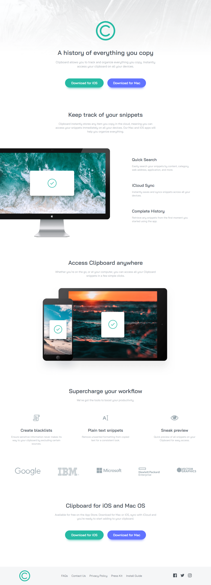

# Frontend Mentor - Clipboard landing page solution

This is a solution to the [Clipboard landing page challenge on Frontend Mentor](https://www.frontendmentor.io/challenges/clipboard-landing-page-5cc9bccd6c4c91111378ecb9). Frontend Mentor challenges help you improve your coding skills by building realistic projects.

## Table of contents

- [The challenge](#the-challenge)
- [Screenshot](#screenshot)
- [Links](#links)
- [My process](#my-process)
  - [Built with](#built-with)
  - [What I learned](#what-i-learned)
- [Author](#author)

### The challenge

Users should be able to:

- View the optimal layout for the site depending on their device's screen size
- See hover states for all interactive elements on the page

### Screenshot



### Links

- Solution URL: [Github](https://github.com/MohtashimAli85/clipboard-landing-page)
- Live Site URL: [Vercel](https://your-live-site-url.com)

## My process

First I code html with classes of full desgin then I start live server. In liver server web, I open browser dev tools i.e, inspection to the right side so by looking at the design and then html in browser I style the web and get the work done.
I always start from Mobile First design then move towards desktop design.

### Built with

- Semantic HTML5 markup
- CSS custom properties
- Flexbox
- Mobile-first workflow

### What I learned

I learned this combinator "+" which is known as adjacent sibling selector. It is used to select an element that is directly after another specific element.
Sibling elements must have the same parent element, and "adjacent" means "immediately following".

```css
.btns .btn + .btn {
  margin-top: 1.5rem;
}
```

So It will add top margin of second button not the first why ? because the first btn don't have another btn above it.

## Author

- Frontend Mentor - [@MohtashimAli85](https://www.frontendmentor.io/profile/MohtashimAli85)
